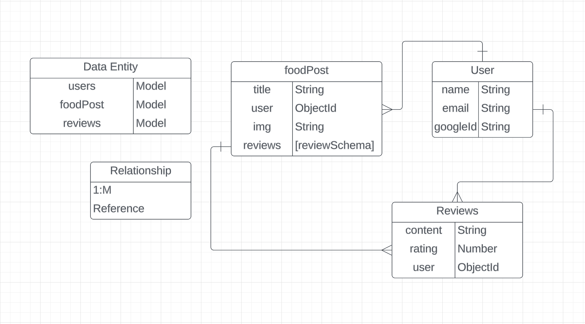
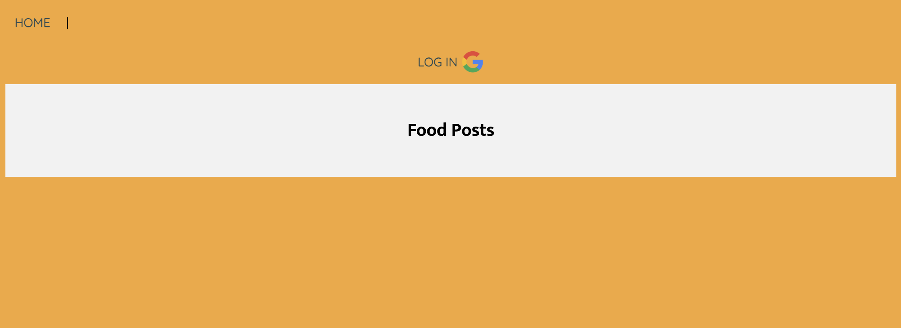
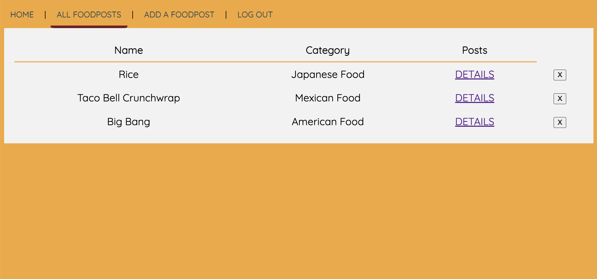
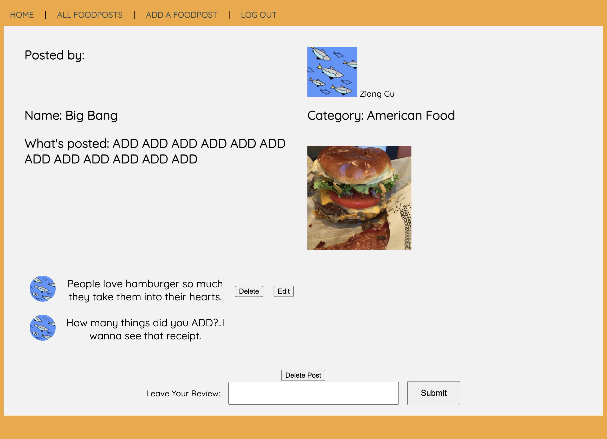
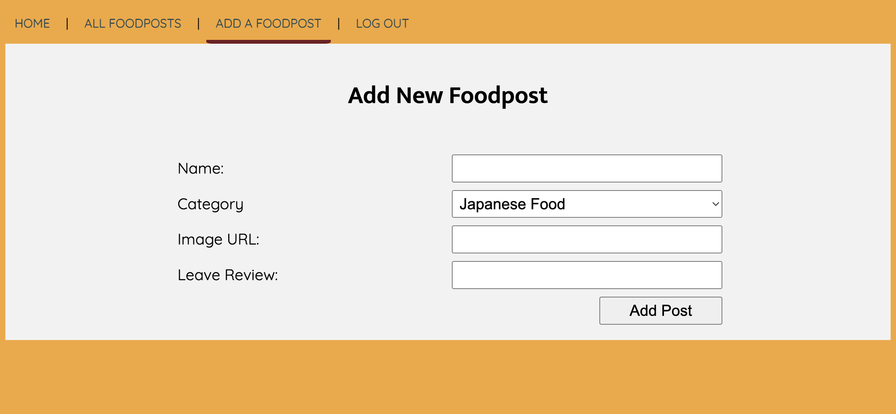

### 🚩 Project-2 Mongoose-Foodpost -  ###
This second project of the software engineering immersive course at GA requires requires to use Node/Express/MongoDB to build a FUll-stack CRUD Application, and with using OAuth authentication. Let's we go from <a href="https://mongoose-foodpost-3607c90f45c4.herokuapp.com/">here</a>

### 📝 Technologies Used ###
* HTML5
* CSS3
* JavaScript (ES6)
* Node.js
* Express
* EJS
* MongoDB
* Git

### 🌊 Get Started ###
This is a platform where users can post their favorite foods and to give comments based on different shares. They will be able to check people's posts, add their own posts, as well as comment under others' posts. 

#### ERD Map ####
- ERD Map.
</img>
An accurate ERD (Entity-Relationship Diagram) guides me, as a web creator, on how to think about the relationships between different entities, as well as the pathways through which they interact. It also allows me to take a 'step back' and view the network paths and data transmission, including the relationships between requests and responses. Not only does it allow me to refine the paths on my Trello board in some greater details, but it also helps me plan my project more effectively.

#### Object Plan ####
The correct and standardized use of Objects has become apparent to me as a beginner after numerous attempts, failures, and guidance. The naming of each key can greatly improve the accuracy of usage across different paths.
```js
const reviewSchema = new Schema({
    content: {
      type: String,
    },
    user: {
        type: Schema.Types.ObjectId,
        ref: 'User',
        required: true
    }
  }, {
    timestamps: true
  });
```
#### Debug on Tiny Pieces ####
"Undefined title," "404 Error," "r is not defined"... So many bugs have appeared in this project. Following the instructor's guidance, I gradually learned how to properly view "nodemon crashed" as well as the aforementioned detailed issues. Each prompt detail indicates that there is no precise input.
```js
async function edit(req, res) {
    console.log(req.params.foodpostId)
    const foodpost = await Foodpost.findById( req.params.foodpostId);
    const review = foodpost.reviews.id(req.params.reviewId);
    res.render('foodposts/edit', { title: 'edit a review', review});
  }
```

#### Routes ####
These seven controllers are extremely important and are handling a lot of responsibilities or functionalities, they are holding up my sky!
```js
router.get('/', foodpostsCtrl.index)
router.get('/new', foodpostsCtrl.new)
router.post('/', foodpostsCtrl.create);
router.get('/:id', foodpostsCtrl.show);
router.delete('/:id', foodpostsCtrl.delete);
router.post('/:id/reviews', foodpostsCtrl.addReview);
router.delete('/:foodpostId/reviews/:reviewId', foodpostsCtrl.deleteReview);
```
#### Challenges ####
Only spent two weeks learning Node/Express/MongoDB and CRUD before embarking on this project. Throughout its development, I had to repeatedly consult course lectures, refer to Mongoose documentation, read, learn, write code, and debug issues. I couldn't have completed this project without the invaluable assistance from our instructors. I deeply appreciate their time and generosity, and I'm glad to have finished the entire project and met the Minimum Viable Product (MVP) criteria just before the deadline.
```js
async function edit(req, res) {
    console.log(req.params.foodpostId)
    const foodpost = await Foodpost.findById( req.params.foodpostId);
    const review = foodpost.reviews.id(req.params.reviewId);
    res.render('foodposts/edit', { title: 'edit a review', review});
  }
  
async function update(req, res) {
    const foodpost = await Foodpost.findOne({'reviews._id': req.params.id});
    const reviewSubdoc = foodpost.reviews.id(req.params.id);
    if (!reviewSubdoc.user.equals(req.user._id)) return res.redirect(`/foodposts/${foodpost._id}`);
    reviewSubdoc.content = req.body.text;
    try{
        await foodpost.save();
    } catch(error) {
        console.log(error.message);
    }
    res.redirect(`/foodposts/${foodpost._id}`);
}
```

**Screenshots**
- Home Page
</img>

- All Foodposts Page
</img>

- Foodpost Details/Comments Page
</img>

- Add Foodpost Page
</img>

### 🤔 Next Steps ###
- Add more features like edit foodposts
- Add more pages and more functions
- Continue practice more on Node.js/Express/MongoDB/Mongoose 
- Enrich current project with seeding and API 